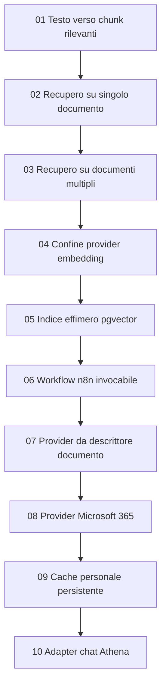

# PRD: roadmap del recupero documentale

## Contesto

Guarda [00-project-vision.md](./00-project-vision.md) per capire il quadro generale del progetto.

PRD precedenti: nessuno.

## Obiettivo

Costruire il recupero documentale con passaggi lenti, piccoli e testabili. Il primo step non deve dipendere da chat Athena, Microsoft Graph, n8n, utenti, conversazioni o cache persistente.

La prima funzionalità funzionante è:

`prompt + testo grezzo -> chunk rilevanti`

Solo dopo che questo nucleo è stabile aggiungiamo documenti, documenti multipli, Cohere, pgvector, n8n, Microsoft 365, cache e infine integrazione con la chat Athena.

## Sequenza di sviluppo

## Principio di prodotto

Ogni PRD aggiunge una sola capacità significativa. Uno step è completo solo quando può essere testato da solo, con wrapper o input simulati dove necessario.

## Direzione architetturale iniziale

- Supabase pgvector è l'unico vector store per questa funzionalità.
- n8n orchestra ingestione documentale, chunking, embedding e retrieval vettoriale.
- Cohere fornisce gli embedding.
- Athena possiede UX chat, stato della conversazione e, in seguito, il registro documentale.
- Microsoft 365/File Picker non fa parte dei primi step backend.

## Validazione

La roadmap è valida solo se ogni PRD successivo:

- definisce criteri di validazione verificabili;
- chiarisce quando serve validazione semantica assistita da LLM;
- dichiara quali capacità precedenti devono continuare a funzionare;
- mantiene test di regressione sugli step già completati;
- produce output JSON ispezionabile.

## Harness di test

Ogni step deve includere o estendere un harness autonomo. L'harness deve simulare l'input di produzione previsto per quello step e deve avvicinarsi progressivamente al flusso finale Athena + n8n + pgvector + Microsoft 365.

La roadmap non considera completo uno step se il comportamento è dimostrabile solo manualmente.

## TDD e riuso

Ogni step deve partire dai test. Il codice dello step precedente deve essere usato come base, non riscritto.

Sono ammessi adattamenti di interfaccia e piccoli miglioramenti quando emergono dai test, ma non duplicazioni parallele della stessa logica.
